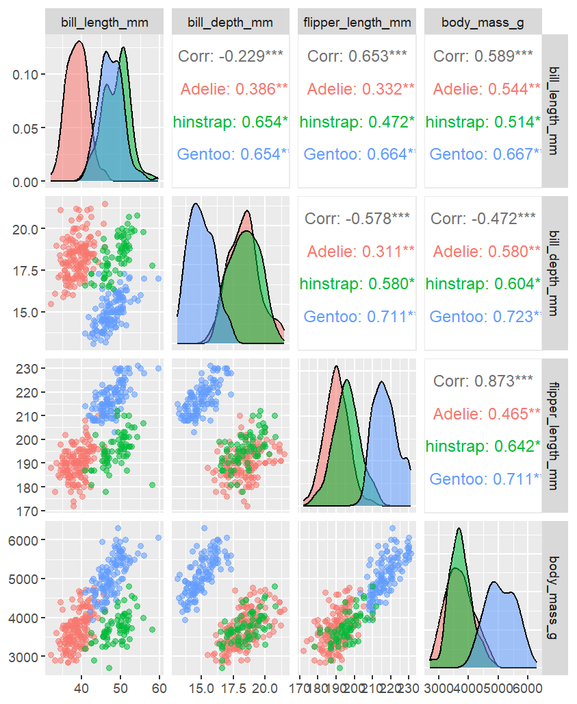

Note that your homework should be completed in Quarto. You can just add your answers and code to this document in the appropriate part. The file should be rendered as an html document or pdf document (html is quicker to render and you will need an installation of LaTeX to render as a pdf). You will "turn in" this homework by uploading the files, the .qmd and output file, to your GitHub `Math_3190_Assignment` repository in the `Homework/Homework_7` directory. Make sure all supporting files (if there are any) are in this directory as well. You should use `git` and `Unix` commands in a terminal for this (i.e. don't manually upload files to GitHub). In addition, you will submit just your html or pdf file on Canvas to unlock the solutions.

Don't forget to also put a [self-critique comment]{.underline} on Canvas indicating what you did correctly and incorrectly and include any questions you may have about the assignment after submitting the assignment and thoroughly looking through the solutions.

# Problem 1 (57 points)

In Homework 6, we briefly looked at a small sample from this data set. Now we have the full data set with 20,640 districts. For districts in California from 1990, we want to predict the median house value for the district based on the district location (longitude and latitude), the median house age in the block group, the total number of rooms in the homes, the total number of bedrooms, the population in the district, the number of households, and the median income (in \$10,000). These data were obtained from [scikit-learn.org](https://scikit-learn.org/stable/datasets.html) and can be found in the Data folder of the Math3190_Sp26 GitHub repo with the name `cal_housing.data`.

### Part a (5 points)

Read in the data. The `read.csv()` function works for files that end in `.data` if they are comma separated like this file is. However, be aware that the housing data does not have column names, so make sure to put `header = FALSE`. Assign appropriate column names to the columns and then take logs (base e) of all variables except lat and long. Once this is done, split the data into training and testing sets with the testing containing 20% of the values. Set a seed when you do this.

```{r}
#| label: part_1a

library(math3190package)
df = read.csv("cal_housing.data", header=FALSE)

df = df |>
  rename(long=V1,
         lat = V2,
         house_age = V3,
         total_rooms = V4,
         total_bedrooms = V5,
         population = V6,
         num_household = V7,
         med_income = V8,
         med_house_val = V9
         ) |>
  mutate(l_house_age = log(house_age),
         l_total_rooms = log(total_rooms),
         l_total_bedrooms = log(total_bedrooms),
         l_population = log(population),
         l_num_houshold = log(num_household),
         l_med_income = log(med_income),
         l_med_house_val = log(med_house_val)) |>
  select(-house_age, -total_rooms,-total_bedrooms,-population,-num_household,-med_income,-med_house_val)
  


# split into train/test
y = df$l_med_house_val
x = df[, -9]

library(caret)
set.seed(7)
test_index = createDataPartition(y, times=1, p= 0.2, list=FALSE)

test_set = df[test_index,]
train_set = df[-test_index,]
```

### Part b (5 points)

Use the following command to view pair-wise scatter plots for the data here. Change `housing_train` to whatever you called the training set and be sure to change the `eval` option for the code chunk to `true`. Note, that `lower` option changes the points to be plotted with periods instead of circles. This speeds up plotting time considerably and makes the plots more readable since there are many data points here.

Based on these plots, does multicollinearity appear to be an issue here? Explain.

```{r}
#| label: part_1b
#| cache: true
#| eval: true
library(GGally)
ggpairs(train_set, 
        lower = list(continuous = wrap("points", shape = "."))
)
```

Yes, V2 and V1 has a correlation coefficient of -0.923, V5 and V4 has a correlation coefficient of 0.93, V6 and V4 have a correlation coefficient of 0.859, V4 and V7 have a correlation coefficient of 0.919, V5 and V7 have a correlation coefficient of 0.981, V6 and V7 have a correlation coefficient of 0.908, V5 and V6 have a correlation coefficient of 0.88.

### Part c (4 points)

Fit a OLS regression model predicting house prices from all other variables. Check its summary output and its VIF values. Comment on the VIFs.

```{r}
#| label: part_1c

ols_model = lm(l_med_house_val~., df)

library(car)
vif(ols_model)
```

All variables have a VIF value higher than 5 except for house age and median income. Total bedrooms has a VIF of 39.19 and number of households has a VIF of 33.15. There is an issue with multicollinearity.

### Part d (3 points)

Fit a principal component model using the `pcr()` function in the `pls` package. Since the variables are on very different scales, use the `scale = TRUE` option in the function. Then find the VIF values for this model. The `vif()` function from the `car` library won't work here. Instead, you can take the diagonals of the inverse of the correlation matrix (like is shown in the regularization section of Notes 7) for the `scores` output. The code for this is `diag(solve(cor(pca_model$scores)))`. Of course, you need to change `pca_model` to what you called your model.

```{r}
#| label: 1d

library(pls)
pca_model = pcr(l_med_house_val~., data = df, scale=TRUE)
diag(solve(cor(pca_model$scores)))
```

### Part e (5 points)

Now take the summary of your principal component model. With PCA, the common amount of variation we want to explain in the predictors is 90% or more. How many components are needed to achieve this? For that number of components, how much of the variation in log of home values is explained? How many components are needed to explain a "good" amount of the variation in the log of home values? Note: the upper bound on the amount of variation in the log of home values here with all 8 components will be equal to the $R^2$ value of the OLS model.

```{r}
#| label: 1e
summary(pca_model)
```

We need 4 components. It will explain 96.36% of the variation in X. 52.39% percent of variation in log of home values will be explained. We will need 8 components to explain a good amount in y, but even then, it will only explain 63.71% of the variation.

### Part f (4 points)

Now fit a partial least squares model using the `plsr()` function in the `pls` package with `scale = TRUE`. Then find the VIF values for this model like you did in part (d) and comment on them.

```{r}
#| label: 1f

plsr_mod = plsr(l_med_house_val~., data =df, scale = TRUE)
diag(solve(cor(plsr_mod$scores)))
```

### Part g (4 points)

Now take the summary of your partial least squares model. Compare this output to the summary of the PCA model. Explain what the differences are.

How many components are needed to balance a good amount of variation explained in $X$ and in $y$ for the PLS model?

```{r}
#| label: 1g

summary(plsr_mod)
```

The PLS model explains less of X and more of y. We need 5 components to get 97% of variation explained in X and 66.92% of variation explained in y.

### Part h (8 points)

In part (e), you said how many components were needed for the PCA to explain a good amount of the $Y$ variable. Using that number of components, use the PCA and PLS models to find the root MSE when predicting the testing set. Note: the root MSE (or residual standard error, also abbreviated RMSE) is found by taking the square root of the sum of squared residuals divided by the residual degrees of freedom, which is $n-p-1$, where $p$ is the number of predictors in the model. Also, be aware that when you use the `predict()` function on your model, it will give you predictions for each number of components. You can access the predictions for using 3 components, for example, by typing `predict(pca_model, test_set)[,,3]`.

Then in part (g), you said how many components were needed for the PLS Using that number of components. Using this number of components, use the PCA and PLS models to find the root MSE predicting the testing set.

```{r}

#| label: 1h

# pca
pca_pred = predict(pca_model, test_set)[,,4]
y_test = test_set$l_med_house_val
rmse_pca = sqrt(sum((y_test - pca_pred)^2) / (length(y_test) - 4 - 1))
rmse_pca

#pls
pls_pred = predict(plsr_mod, test_set)[,,5]
rmse_pls = sqrt(sum((y_test - pls_pred)^2) / (length(y_test) - 5 - 1))
rmse_pls
```

Compare the results of the predictions in both cases.

The PCA model has an RMSE of 0.41 while the PLS model has an RMSE of 0.34. The PLSS model is more accurate.

### Part i (12 points)

Using the number of components you said were needed for the PLS model in part (g), come up with reasonable surrogates for each of those components. Look at the projection output for this. When creating your surrogates, make sure to center and scale each variable. You can do this with the `scale()` function and putting your housing data frame or tibble in it.

Then fit a OLS model using those surrogates in the training set. Check the VIF of this model to make sure each one is below 5. If they are not, your surrogates should be changed. You can use the `vif()` function in the `car` package here.

```{r}
#| label: 1i

round(plsr_mod$projection, 3)

X = select(train_set,-l_med_house_val)
Xs = scale(as.matrix(X))

surr1 = (Xs[,4] + Xs[,5] +Xs[,7] + Xs[,8])/4 - Xs[,2]
surr2 = Xs[,8]
surr3 = Xs[,3]-Xs[,1]
# surr3 = (Xs[,3] + Xs[,5] + Xs[,7])/3 - (Xs[,1] + Xs[,2] + Xs[,6])/3
surr4 = (Xs[,5] + Xs[,7])/2 - (Xs[,1]+Xs[,2]+Xs[,6])/4
surr5 = (Xs[,1] + Xs[,2] + Xs[,3] + Xs[,4] + Xs[,6])/5

surr_mod = lm(l_med_house_val ~ surr1 + surr2 + surr3 + surr4 + surr5, data = train_set)
vif(surr_mod)
```

### Part j (7 points)

Now using that model you fit in the previous part with the surrogates, find the root MSE for predicting the testing set using that model, and compare it to what you got in part (h). Describe some pros and cons of the surrogate model.

Hint: to predict using this model, you will have to create a `newdata` data frame (or tibble) and then redefine your surrogates in that data frame using the scaled testing data set. Make sure the variable names in the `newdata` data frame match the variables names used in the model you defined in part (i).

```{r}
# rotation <- pca_model$rotation[, 1:5]
# 
# test_scaled <- scale(test_set[,-9],
#                      center = attr(pca_model$scale, "scaled:center"),
#                      scale  = attr(pca_model$scale, "scaled:scale"))
#   
# Z_test <- test_scaled %*% rotation
# 
# # Put into dataframe with correct names
# newdata <- as.data.frame(Z_test)
# colnames(newdata) <- paste0("Z", 1:k_pcr)
# 
# pred <- predict(surr_mod, newdata = newdata)
# 
# y_test <- test_set$l_med_house_val
# n <- length(y_test)
# p <- k_pcr
# 
# rmse_surrogate <- sqrt(sum((y_test - pred)^2) / (n - p - 1))
# rmse_surrogate
```

# Problem 2 (33 points)

In base **R**, there is a dataset called `penguins`. Type `?penguins` to read a little about the data.

### Part a (6 points)

Remove the rows in the penguins dataset that have missing values. Then use the `ggpairs()` function from `GGally` to make pairwise scatterplots for the four quantitative variables and color the points based on the `species` variable. Note that the `ggpairs()` function has a `columns` argument where you can select the columns you want to plot and it has a `mapping` argument where you can put `aes(color = species, alpha = 0.5)` to color the points by species.

Include the plot here and then comment on which scatterplots seem to nicely separate the penguins by species and which tend to have worse separation.

```{r}
#| label: 2a
#| cache: true

library(GGally)
library(palmerpenguins)

df2 = penguins
df2 = drop_na(df2)

ggpairs(df2, columns = 3:6, mapping = aes(color=species, alpha = 0.5))
```

The best scatterplots that separate the species seems to be bill length and flipper length. The worst one is body mass and flipper length.



### Part b (4 points)

Run a scaled principal component analysis on the four quantitative variables using the `prcomp()` function. How much of the total variation in these variables is explained by the first two principal components? You can use the `summary()` function on your PCA to find this easily.

```{r}

#| label: 2b

X = df2[3:6]
pca = prcomp(X, scale=T)
summary(pca)
```

The first two principal components will explain 85.08% of total variation.

### Part c (6 points)

Plot the first two principal components with PC1 on the x-axis and PC2 on the y-axis. Color the points by species and comment on how well the first two principal components are separating by species.

```{r}
#| label: 2c

pca_df <- data.frame(
  PC1 = pca$x[, 1],
  PC2 = pca$x[, 2],
  species = df2$species
)

ggplot(pca_df, aes(x=PC1, y=PC2, color=species))+
  geom_point()
```

It does not separate Adelie and Chinstrap penguins very well, but it separates Gentoo penguins from the others very well.

### Part d (12 points)

Now use the `umap()` function in the `umap` library to fit a UMAP to the **scaled** quantitative variables in the penguins dataset. You can use the `scale()` function to scale the variables. Make sure the UMAP gives two components and set a `random_state` in the function so your results are reproducible. Then plot the UMAP using the the `umap_plot()` function in `math3190package` and color the points by `species` using the `color_umap` argument. Experiment with at least three different number of neighbors (`n_neighbors`) and at least three different minimum distances (`min_dist`).

```{r}
#| label: 2d

library(math3190package)
library(umap)

umap = umap(df2[3:6], n_components=2, random_state = 7, n_neighbors=15, min_dist=0.5)  
umap_plot(umap, data = df2, color_umap="species", size=2) +
  scale_color_viridis_d()

umap = umap(df2[3:6], n_components=2, random_state = 7, n_neighbors=50, min_dist=0.9)  
umap_plot(umap, data = df2, color_umap="species", size=2) +
  scale_color_viridis_d()

umap = umap(df2[3:6], n_components=2, random_state = 7, n_neighbors=100, min_dist=0.8)  
umap_plot(umap, data = df2, color_umap="species", size=2) +
  scale_color_viridis_d()
```

### Part e (5 points)

Comment on the UMAP plots you made in part (d). Include a comparison to the PCA plot regarding how well these species are separated.

Feel free to repeat this problem using a variable other than species! Sometimes the UMAP outperforms PCA at separating classes, sometimes it does a little worse, and sometimes there are both quite bad.

They were both pretty bad, but I think PCA was slightly better. Both had problems with discerning Adelie and Chinstrap.
